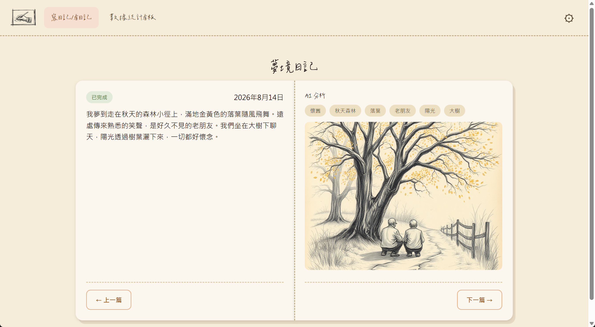
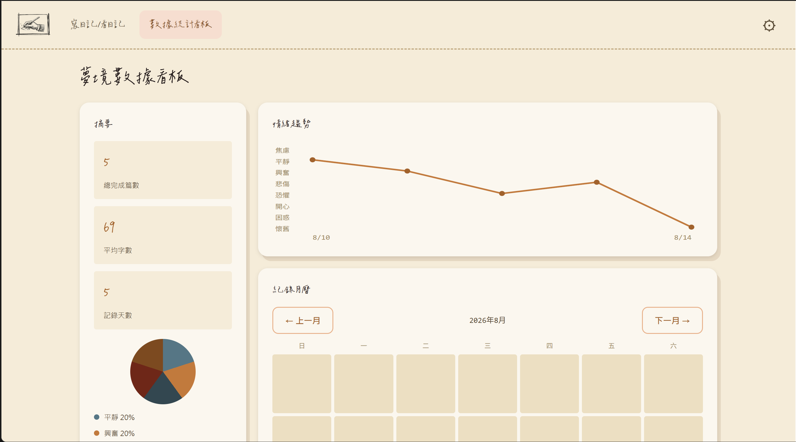

<div align="center">
  

  # AI 夢境日記

  用手繪素描本的溫度，記錄每一個夢。AI 自動分析情緒、生成專屬插圖。

  [](LICENSE)
  [](https://react.dev)
  [](https://www.typescriptlang.org/)
  [](https://vercel.com)

  [線上體驗](https://ai-dream-journal-eta.vercel.app) · [回報問題](https://github.com/zoewang7512/ai-dream-journal/issues)
</div>

---

## 這是什麼

**AI 夢境日記**是一個純前端的個人夢境日記應用：每天寫下一則夢，完成後觸發一次 AI 分析——Gemini 會判斷這則夢的情緒、萃取關鍵字，並生成一段英文 image prompt；Pollinations.ai 再依這段 prompt 產出一張手繪鉛筆素描風格的插圖，讓每篇日記都配上一張獨一無二的畫。

所有資料只存在瀏覽器的 LocalStorage（不需要註冊、不需要資料庫），並提供 JSON 匯出/匯入做備份與還原。頁面二則把累積下來的資料視覺化成情緒趨勢、紀錄月曆、情緒分佈與關鍵字文字雲四張圖表。

## 線上體驗

**[ai-dream-journal-eta.vercel.app](https://ai-dream-journal-eta.vercel.app)**

## 畫面展示

<!--
  請把兩張實際畫面截圖存到以下路徑，取代這個提示區塊：
  - docs/screenshots/journal-page.png（頁面一：日記詳情，含 AI 分析與生成插圖）
  - docs/screenshots/dashboard.png（頁面二：數據看板，四張圖表）
-->

| 日記與 AI 分析 | 數據看板 |
|---|---|
|  |  |

### AI 生成插圖範例

<p align="center">
  
  
</p>

## 功能特色

- 📔 **每日夢境日記** — 當天可自由編輯暫存，完成後轉為唯讀；模仿實體日記的翻頁互動瀏覽歷史紀錄。
- 🧠 **AI 情緒與關鍵字分析** — 透過 Gemini 將夢境文字轉換成結構化的情緒分類與關鍵字，每篇日記僅觸發一次分析。
- 🎨 **手繪風格 AI 插圖** — 系統提示詞強制注入鉛筆素描、交叉影線等修飾詞，確保每張圖都是純黑白手繪質感，並經後端安全代理呼叫 Pollinations.ai。
- 📊 **數據分析看板** — 情緒趨勢折線圖、紀錄月曆熱力圖、情緒分佈圓餅圖、關鍵字文字雲，資料不足時顯示引導文案而非空白畫面。
- 💾 **備份與還原** — 一鍵匯出全部資料為 JSON；匯入前會先確認「將覆蓋所有資料」，格式驗證失敗時不寫入任何內容。
- 🔒 **金鑰安全代理** — Gemini／Pollinations 金鑰只存在後端環境變數，前端與版本控制皆搜尋不到金鑰字串；圖片代理端點另有來源限制與速率限制防濫用。

## 技術棧

| 分類 | 技術 |
|---|---|
| 前端 | React 18、Vite、TypeScript（strict）、React Router |
| 後端 | Node.js、Express（作為 Gemini／Pollinations 的安全代理，不外露金鑰） |
| AI 服務 | [Google Gemini API](https://ai.google.dev/)（結構化分析）、[Pollinations.ai](https://pollinations.ai/)（flux 模型圖片生成） |
| 資料儲存 | 瀏覽器 LocalStorage（無資料庫、無登入） |
| 測試 | Vitest、Testing Library |
| 部署 | Vercel（前端靜態站台 + Serverless Function 後端代理） |

## 本機開發

### 前置需求

- Node.js（建議與 [Vercel 部署版本](https://vercel.com) 一致，目前為 24.x）
- 一組 [Gemini API](https://aistudio.google.com/apikey) 金鑰
- 一組 [Pollinations.ai](https://pollinations.ai/) 的 Secret API 金鑰（`sk_` 開頭）

### 安裝與啟動

```bash
git clone https://github.com/zoewang7512/ai-dream-journal.git
cd ai-dream-journal
npm install
cp .env.example .env
```

編輯 `.env`，填入兩把金鑰：

```bash
GEMINI_API_KEY=你的-gemini-金鑰
POLLINATIONS_API_KEY=你的-pollinations-金鑰
PORT=3001
```

```bash
npm run dev
```

會同時啟動前端（`http://localhost:5173`）與後端 API（`http://localhost:3001`），Vite 會把 `/api/*` 請求代理到後端。

> ⚠️ `.env` 已加入 `.gitignore`，金鑰只會存在後端環境變數，絕不會被提交進版本控制或打包進前端 bundle。

## 可用指令

| 指令 | 說明 |
|---|---|
| `npm run dev` | 同時啟動前端與後端開發伺服器 |
| `npm run dev:web` | 只啟動前端（Vite） |
| `npm run dev:api` | 只啟動後端 API（`tsx watch`） |
| `npm run build` | 型別檢查 + 建置正式版前端 |
| `npm run test` | 執行全部測試（Vitest） |
| `npm run lint` | ESLint 檢查 |
| `npm run typecheck` | TypeScript 型別檢查（不輸出檔案） |
| `npm run kanban` | 啟動本機治理看板（視覺化 `tools/kanban/`） |

## 專案架構

```text
src/            前端（頁面、UI 元件、資料存取）
  pages/journal/    頁面一：日記撰寫與瀏覽
  pages/insights/   頁面二：數據分析看板
  components/ui/    共用 UI 元件庫
  lib/              LocalStorage 存取、備份匯出入
server/         後端 Express：Gemini／Pollinations 安全代理
api/            Vercel Serverless Function 進入點
ai/             產品規格書、畫面規格、任務卡等治理文件
tools/kanban/   本機任務看板（視覺化 ai/ 底下的任務卡）
```

## 開發方法論

這個專案完整走過一套「AI 輔助、人工把關」的開發流程（[Monstrare](ai/process/workflow.md)）：每個功能先寫規格書、UI 變更先產出多個 mockup 變體交由人工選擇，再拆成範圍受限、附驗證契約的任務卡逐一實作；高風險或安全性相關的變更（例如金鑰代理、匯入資料驗證）額外通過獨立的安全性審查關卡；每張任務卡完成後都附上測試指令、輸出與螢幕截圖等驗證證據，最終才由人工核准。完整的規格書與任務卡歷史保留在 [`ai/artifacts/`](ai/artifacts/)。

## 授權

本專案採用 [MIT License](LICENSE)。
